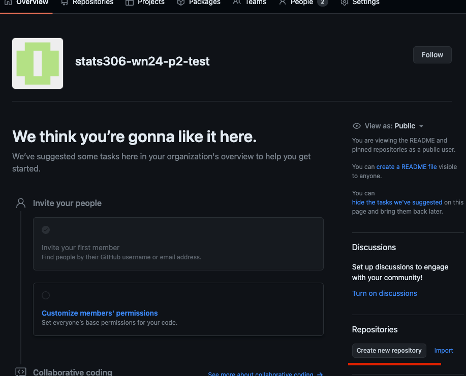
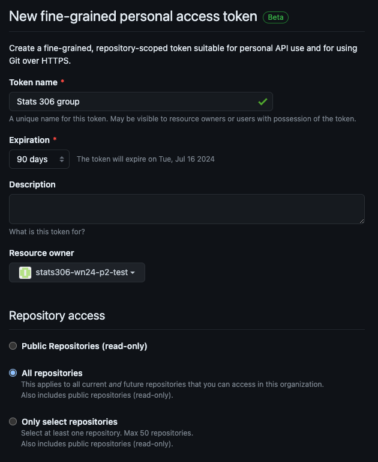

# README

## Directions to Get Set Up

Getting your team ready to collaborate on the project will require the following steps:

### Create a Private Repository for Your Group

One team member should create a repository for your team on their own personal page.



Select the "Private" option.

Do not add a `README`, `.gitignore`, or license file (these will come later).

For the moment, leave the repository empty (i.e., do not follow the directions for how to commit your first files that you will be shown).

The team member who owns the repository should add the other team members as Collaborators.


### Creating a Personal Access Token

GitHub's Personal Access Tokens function similarly to passwords for an account but they can be limited to certain repositories and have an expiration date. One user can have more than one PAT, so they can also be easily revoked if they become compromised without having to freeze the entire account.

Each team member will need to create a PAT with permissions to view and edit the shared repository.

To do so, go to you user icon and select Settings


On the left hand side of the screen, select "Developer Settings".


Then select "Personal Access Token" and "Fine-grained Tokens". Then "Generate New Token".



On this screen, select your token name and expiration length. For the resource owner, you should see the team member who invited collaborators. Under "Repository Access", select "Only select repositories" and find the private team repository in the drop down menu.


Under "Permissions", select the "Repository" section. Scroll down to find "Contents" and set this to the "Read and Write" option. Scroll to the bottom and generate your token.


Copy the token and store it somewhere safe. If you use a password manager for your web browser, you can store it there. We will copy it to posit cloud shortly, so you will not need to access it frequently, but you may need it later. After you close this page, you will not be able to retrieve it from github.


### Creating Posit Cloud Projects

Each team member should create a new Posit Cloud project in the Stats 306 workspace.

In your Terminal tab, run the following commands:

```
git init .
git config user.name "Your Name"
git config user.email "Your Email Address"
git config credential.helper store
git branch -M main
```

Go to GitHub and retrieve the `https://github.com/...` version of the URL to your repository.


Back in the terminal in Posit Cloud run the following commands:

```
git remote add origin HTTPS_URL
git remote add upstream https://github.com/Stats-306-Fredrickson/stats306_100_wn24_project_2.git
```

Where `HTTPS_URL` is the URL you copied from GitHub.

Designate one team member to do the following:

```
git pull upstream main
git push origin main
```

During this process, the user will be prompted for a user name (this is your **GitHub username**, not your email) and your password. For the password, copy and paste in your PAT. You will not see the password, but after you paste it in, press enter.

This will bring the Project 2 materials into the shared team repository on GitHub

Now all members can run the following:

```
git pull -u origin main
```

They will not get copies of the shared repository. Later, after adding and committing changes, you can use

```
git pull origin main
git push origin main
```

to retrieve and share your changes.

## Project Abstract

You will complete this portion at a later time.

## Team

Each team member should add a brief biography (year, program, interests). You may add a photo, but it is not required.
